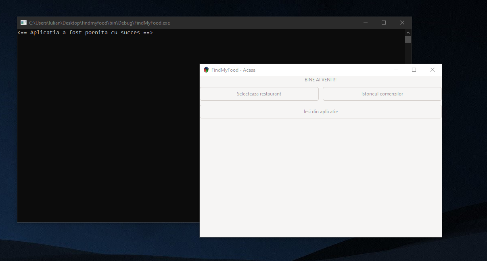
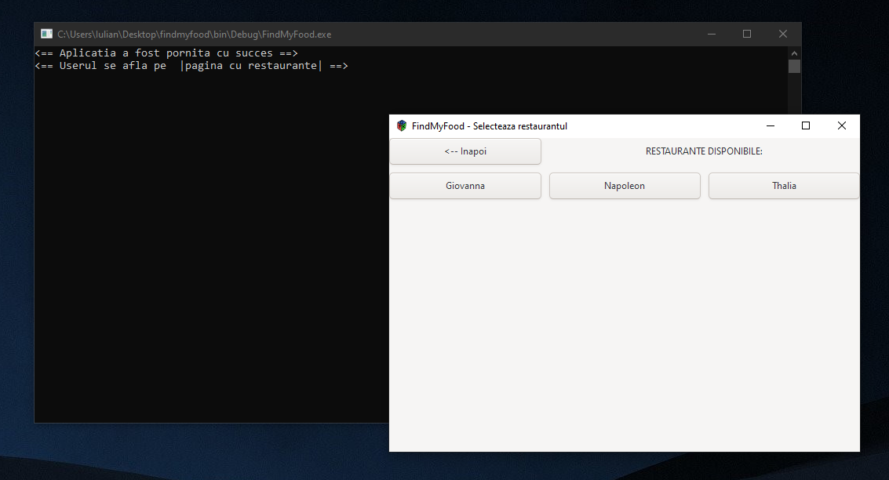
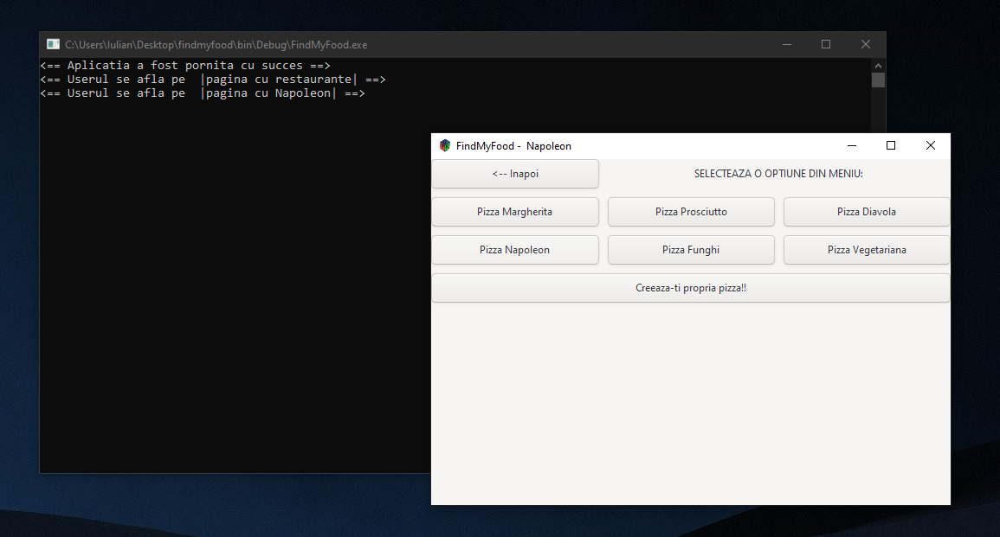
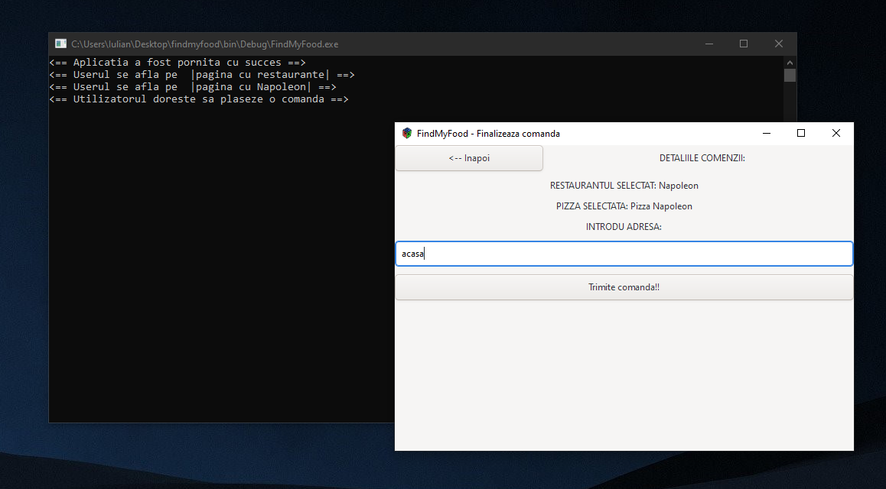
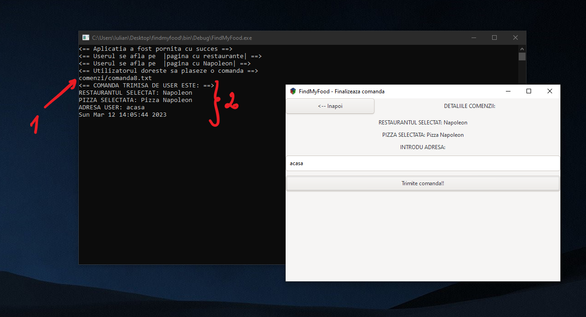
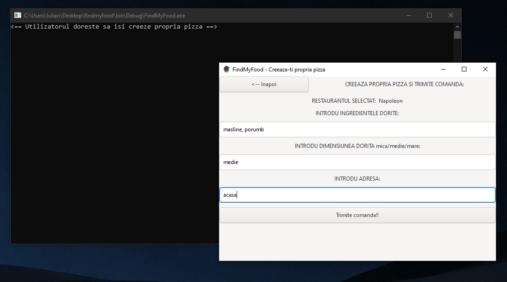
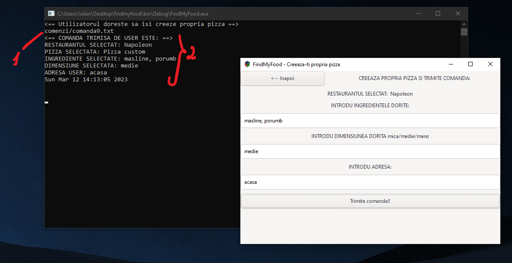
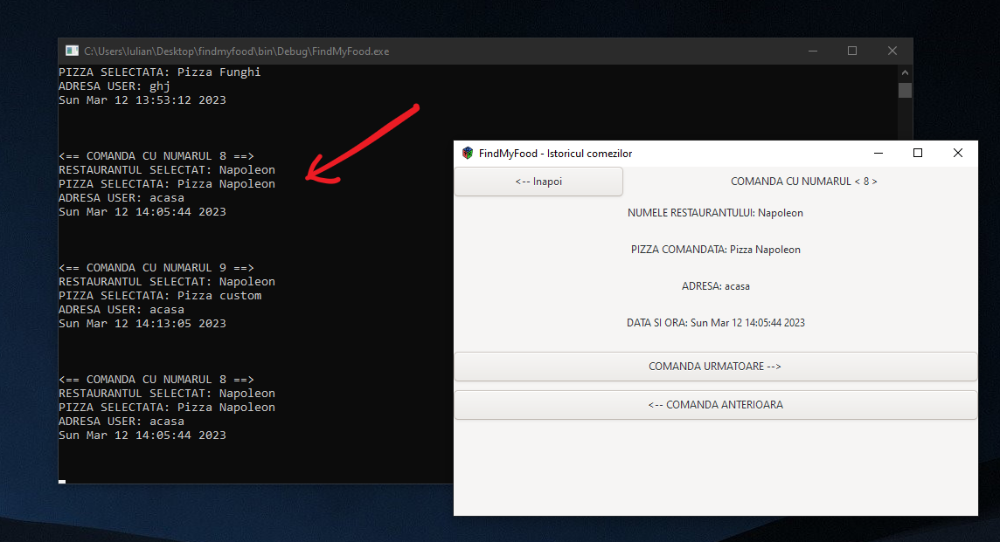

# FindMyFood

This project was made for a course from university. The purpose of the application is to help the user find something to eat.

### Home
First of all, the user is greeted when enetering the app and is presented with three options: 
- Possibility to find something to eat
- Possibility to see previous orders
- Possibility to exit the app

###### *All the user interection can be seen in the left (console window).

---

### Select restaurant
By pressing *Selecteaza restaurant* the user is redirected to a page where he cand see all the restaurants available. For the purpose of the project I've used three restaurants, all of them are functional, but this doesn't mean they couldn't be more, the app is scalable.

---

### Restaurant page
After selecting from which restaurant he wants to eat, the user is presented the restaurant's meniu(which is not a copy 1:1 of the actual restaurant meniu).

---

### Order page
By selecting something from the meniu, the user needs to sent the order by completing the address where the order should be delivered.

The order is beeing processed and sent when it appears in the log window the file where de order had been saved (1) and the order itself (2).  

And for those who don't want something from the meniu we have the option to make your own pizza.

And the proccesing is the same as before.

---

### Previous orders
The user can see previous orders by entering from the *Home* page in the *Previous order* (Istoricul comenzilor). In the log window it appears every order the user is looking at (exemple: If you look at the order 8, in the log screen appears the order 8).

---
---

## Words about how I've done things
For the order part I've used files. I have a file where I store the total number of orders and every order have it's own file.

---

## Documentation and what I've used

For the graphic part I used a framework named **GTK**. Bellow I've put the installation guide I've used:
- [Video 1](https://www.youtube.com/watch?v=rUJFYOCbuDg&ab_channel=MichaelB.)
- [Video 2](https://www.youtube.com/watch?v=TlwWKzJFNqo&ab_channel=MichaelB.)

And for the understaing of how to use the GTK framework
- [Offical GTK3.0 documentation](https://docs.gtk.org/gtk3/getting_started.html#an-application-menu)

